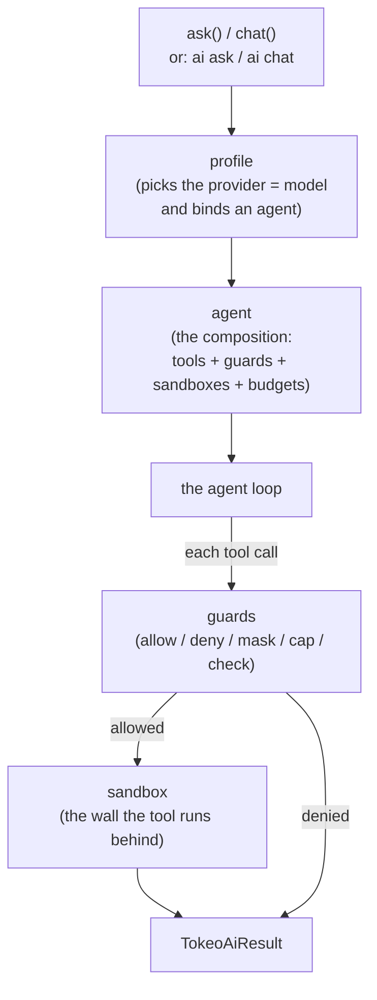
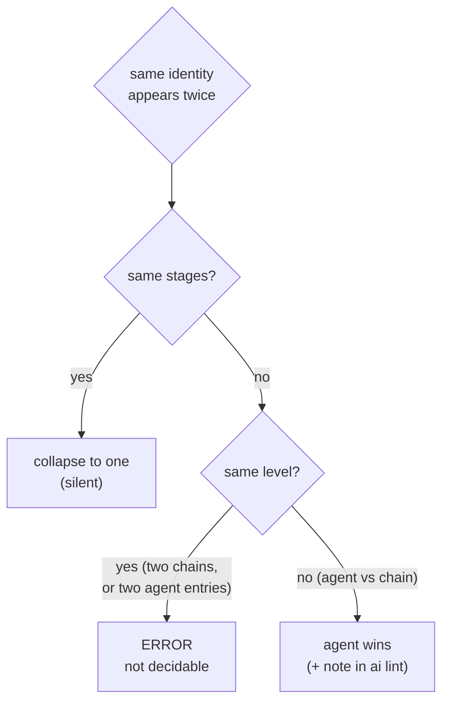
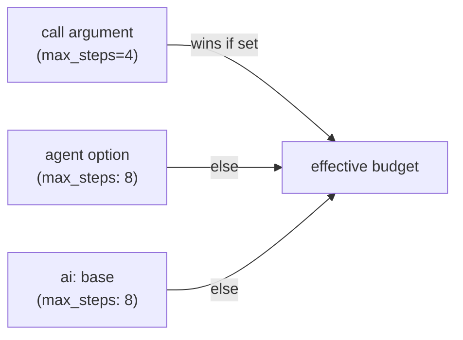

# The `ai` configuration

This is the reference for the `ai:` section of a tokeo application's
configuration: every section, every notation, and how a call tunes a run. The
resolvers that read it live next to this file (`tokeo/core/ai/config/`), one per
component kind; this document describes the shapes they accept.

All examples are YAML under a top-level `ai:` key. Where a value reads
`module.Class`, it is a full dotted import path to a class; where it reads a
short name, it is a built-in registered under that name.

## 1. The shape of `ai:`

```yaml
ai:
  max_steps: 8          # base loop budget (tool rounds), 0 = unlimited
  max_loops: 3          # consecutive empty rounds before abort, 0 = unlimited
  trace: true           # record the step history (the trace)

  defaults:             # what a command uses when it names nothing
    profile: mock
    agent: null

  tools:                # the toolset: items and named groups
  guards:               # the per-call pipeline: declarations and chains
  sandboxes:            # the execution walls a tool runs behind
  agents:               # the compositions: tools + guards + sandboxes + budgets
  profiles:             # model + agent bundles a run selects
```

A run is assembled from four kinds of building block. The diagram shows how a
call flows through them.



.. important::

    The **profile** chooses the model and binds **one** agent. The **agent** is
    the composition root: it owns the tools, the guard pipeline, the sandbox
    chain, and the budgets. A call can *narrow* what the agent offers (deny tools,
    lower budgets) but never *add* to it.

## 2. The uniform item form

Three of the four sections (`tools`, `guards`, `sandboxes`) share one notation
for a single element, the **item**:

```yaml
some_name:
  type: short_name              # a built-in, OR
  type: module.path.SomeClass   # a full dotted class path
  options:                      # the class's own settings (its Meta keys)
    some_setting: value
```

A bare string is the short form of an item with no options:

```yaml
some_name: short_name           # == { type: short_name }
```

.. tip::

    `type` resolves a class; `options` are handed to that class and validated by
    the class itself, not by the linter. The linter checks the *shape* (is there a
    resolvable `type`?), the class checks its *settings*.

## 3. `tools` — the toolset

A `tools:` entry is either an **item** (a dict with a `type`) or a **group** (a
list of member names). Groups may contain groups.

```yaml
tools:
  calc:                                   # an item (dotted path)
    type: myapp.core.ai.tools.calc.CalcTool
  read_file:                              # an item with options
    type: myapp.core.ai.tools.read_file.ReadFileTool
    options:
      base_dir: tmp
  mathematics:                            # a group (a list of members)
    - calc
    - stats
  filesystem:
    - read_file
    - append_file
  everything:                             # a group of groups
    - mathematics
    - filesystem
```

A profile or an agent then activates a single item or a whole group by name.

.. warning::

    A group that transitively contains itself is a configuration error; `ai lint`
    reports it. The resolver breaks the cycle, but the lint fails the run.

## 4. `guards` — the per-call pipeline

A guard acts at one or more **stages** of a tool call. The six stages, in order:

| Stage | When | The guard receives |
|-------|------|--------------------|
| `on_begin` | run start | the accumulated `messages` |
| `on_prompt` | before the model is asked | the `messages` about to be sent |
| `on_answer` | after each model answer | the round's `ChatResult` |
| `on_call` | before a tool runs | the `Invocation` (may deny or reshape) |
| `on_return` | after a tool ran | the completed `Invocation` (result/error) |
| `on_close` | run end | the final `ChatResult` |

### 4.1 Declaring a guard

A `guards:` entry is a **declaration** (a dict), a **short form** (a string), or
a **chain** (a list).

```yaml
guards:
  tool_schema_validate:           # declaration with options
    type: tool_schema_validate
    options:
      strict: true                # deny a malformed call (default: only flag it)
  regex_redact:                   # declaration with options
    type: regex_redact
    options:
      patterns: [bearer, sk-key]  # required: no built-in list
  truncate:                       # a project guard by dotted path
    type: myapp.core.ai.guards.truncate.MyAppAiTruncateGuard
    options:
      limit: 500
```

### 4.2 Per-stage options

A declaration may override its `options` for one stage, under an `on_<stage>`
block. The stage block overlays the base `options`:

```yaml
guards:
  truncate:
    type: myapp.core.ai.guards.truncate.MyAppAiTruncateGuard
    options:
      limit: 2000           # the default for every stage
    on_close:
      options:
        limit: 200          # but cap the final answer harder
```

### 4.3 Composing guards on an agent

An agent's `guards:` list is a **composition** — *where and in what order*
guards run. Each entry is a bare name or a `name: [stages]` stage list.

```yaml
agents:
  demo:
    type: fundi
    options:
      guards:
        - trace_audit           # bare name: runs at all the class's stages
        - truncate: [on_close]  # stage list: runs at on_close only
        - regex_redact          # bare name
```

- A **bare name** runs the guard at every stage its class implements.
- A **`name: [stages]`** entry runs it only at the listed stages (it *replaces*,
  not adds).
- `[_any]` is the explicit form of the bare name — all the class's stages.

.. caution::

    An empty stage list (`name: []`, `name:` or `name: null`) is an error. To run
    a guard at several stages, name them in **one** list: `name: [on_call,
    on_return]`. Listing the same guard twice with different stages is an error
    (see "Union and conflict" below).

### 4.4 Chains

A list value under `ai.guards` is a reusable **chain** — a named composition an
agent (or another chain) can import by name:

```yaml
ai:
  guards:
    secure:                     # a chain
      - trace_audit
      - regex_redact: [on_call, on_return]
  agents:
    demo:
      options:
        guards:
          - secure              # imports the chain's guards in order
          - truncate: [on_close]
        omit:
          - trace_audit         # drop one guard the chain brought in
```

`omit` is a sibling field of `guards`; it drops a named guard from *this*
agent's composition.

### 4.5 Union and conflict (nearest wins)

When the same guard identity appears more than once, the rules are:



.. note::

    A **note** is shown by `ai lint`, not during `ask`/`chat`. An **error** stops
    both: the run aborts and `ai lint` reports it.

## 5. `sandboxes` — the execution walls

A sandbox is the wall a tool runs behind. An agent lists an ordered **chain**; a
tool runs in the first sandbox whose `tools` contain it.

```yaml
sandboxes:
  jailed:                       # an item with a tool selection
    type: subprocess
    tools:
      - mathematics             # tool/group names this sandbox claims
    except:
      - calc                    # ... but not these (chain walks on for them)
  allow:
    type: in_process
    tools: _all                 # the catch-all: every tool that reaches it
```

```yaml
agents:
  demo:
    options:
      sandboxes:
        - jailed                # tried first
        - allow                 # the catch-all, placed last
```

.. important::

    `_all` is the reserved keyword for "every tool that reaches me". When **no**
    sandbox in the chain claims a tool, the call is **denied** — so an
    `in_process` sandbox with `tools: _all` placed last is the opt-in catch-all.
    Note the spelling: sandbox tools use `_all`, a guard's stage list uses `_any`
    — both a single underscore, both reserved *values*.

## 6. `agents` — the compositions

An agent is the composition root a profile binds. It is an item (`type: fundi`
is the standard agent) whose `options` assemble the run: which tools, which
guard pipeline, which sandbox chain, and the budgets.

```yaml
agents:
  guarded:
    type: fundi
    options:
      tools:                    # the tools this agent contributes
        - mathematics
        - filesystem
      guards:                   # the pipeline (a composition, see the guards section)
        - secure                # a chain (brings trace_audit + regex_redact)
        - truncate: [on_close]
      sandboxes:                # the chain (see the sandboxes section)
        - jailed
        - allow
      deny:                     # a hard ban, before any sandbox lookup
        - append_file
      omit:                     # drop a guard the chain brought in (see chains)
        - regex_redact
      max_steps: 8              # per-agent budget override (nearest wins)
      max_loops: 3
```

| Option | Meaning |
|--------|---------|
| `tools` | the tools/groups this agent contributes (the active set of a call) |
| `guards` | the guard composition (the guards section) |
| `sandboxes` | the ordered sandbox chain (the sandboxes section) |
| `deny` | tools/groups forbidden outright, before any sandbox lookup |
| `omit` | guard identities to drop from the composition (chains) |
| `max_steps` / `max_loops` | per-agent budget overrides (nearest wins) |

.. note::

    `deny` is a hard ban (the tool never runs); a sandbox `except` only skips
    *that* sandbox and lets the chain walk on. They are different mechanisms.

## 7. `profiles` — model + agent bundles

A profile names a **provider** (the model, by `type`) and binds an **agent**. A
run selects one profile by name, by `purpose`, by `model`, or the default.

```yaml
profiles:
  mock:                         # the built-in local model
    type: mock
    purpose: mocking            # optional free-form selector
    agent: guarded              # the composition this profile runs

  assistant:
    type: oai_compat            # any OpenAI-compatible server
    options:
      model: "llama-3.1-8b"
      base_url: http://localhost:8000/v1
      # key: ${OPENAI_API_KEY}  # via config resolution, not clear text
    agent: guarded
```

.. important::

    A profile **must** state its `agent`, even as `agent: null` to run without
    one. A profile binding `null` opts out of `ai.defaults.agent` on purpose.

### 7.1 Carving out a subset with `deny`

A profile may `deny` tools or groups, to run a shared agent with a smaller
toolset. The active tools are `agent.tools` minus `agent.deny` minus
`profile.deny`:

```yaml
profiles:
  calendar_only:
    type: mock
    agent: guarded              # a rich agent ...
    deny:
      - mathematics             # ... but this profile drops these groups
      - filesystem
```

## 8. Tuning the model — provider parameters

The `oai_compat` provider passes a `model_params` block straight through to the
endpoint. These steer *how* the model answers. No validation happens in tokeo —
the endpoint owns the valid ranges, which vary by model.

```yaml
profiles:
  assistant:
    type: oai_compat
    options:
      model: "llama-3.1-8b"
      base_url: http://localhost:8000/v1
    model_params:
      temperature: 0.2          # randomness, ~0.0-2.0 (lower = more focused)
      top_p: 0.9                # nucleus sampling cutoff, 0.0-1.0
      max_tokens: 1024          # cap on the answer length
      frequency_penalty: 0.0    # damp repetition, ~-2.0-2.0
      presence_penalty: 0.0
      stop: ["\n\n"]            # string or list that ends generation
      seed: 42                  # fixed value for (mostly) reproducible output
      response_format:          # e.g. structured JSON output
        type: json_object
```

Common keys and what they do:

| Key | Effect |
|-----|--------|
| `temperature` | randomness / creativity (lower = more focused, deterministic) |
| `top_p` | nucleus sampling cutoff |
| `max_tokens` | hard cap on the generated answer length |
| `frequency_penalty` / `presence_penalty` | damp repetition |
| `stop` | string or list that ends generation |
| `seed` | fixed value for (mostly) reproducible output |
| `response_format` | request a shape, e.g. `{type: json_object}` |
| `tool_choice` | `auto` / `none` / `required`, or a named function |
| `model` | override the profile's model for that call only |

.. tip::

    A profile value may sit at the top level **or** under `options` — the provider
    reads either place. Connection settings (`model`, `base_url`, `key`,
    `timeout`) conventionally live under `options`; `model_params` sits at the top
    level.

### 8.1 Overriding parameters per call (CLI)

`ai ask` and `ai chat` take repeatable `--model_param key=value` flags that
override the profile's `model_params` for that one call. The value is coerced
like a YAML scalar; `key=null` *removes* a key, falling back to the profile's
value.

```bash
# more focused for one question
myapp ai ask "summarise this" --model_param temperature=0.1

# several at once
myapp ai ask "be creative" --model_param temperature=1.2 --model_param top_p=0.95

# drop a profile-set key for this call
myapp ai ask "..." --model_param seed=null
```

## 9. Using the loop from your own code

`ask()` and `chat()` are the programmatic entry points on the `ai` handler
(`app.ai`). They take the same selectors as the CLI, so your application logic
can tune a run at the call site.

### 9.1 `ask` — one prompt, the reply text

```python
text = app.ai.ask(
    'weekday of 2026-12-24',
    profile='assistant',        # or model=/purpose= to select a profile
    agent='guarded',            # select the agent (composition)
    model_params={'temperature': 0.1},
    deny=['filesystem'],        # narrow the toolset for this call
    userdata={'request_id': 42},
)
# -> str: the assistant text
```

### 9.2 `chat` — full control, the full result

`chat()` takes a `messages` list and returns the whole `TokeoAiResult`:

```python
result = app.ai.chat(
    messages=[{'role': 'user', 'content': 'calc 2 + 3'}],
    profile='assistant',
    agent='guarded',
    model_params={'temperature': 0.2, 'max_tokens': 512},
    deny=['append_file'],
    max_steps=4,                # lower the budget for this call
    max_loops=2,
    userdata={'tenant': 'acme'},
)

result.answer      # the model's ChatResult (result.answer.text is the text)
result.trace       # the ordered step history (empty if ai.trace is false)
result.status      # the run's status
```

The call arguments and where each is resolved:

| Argument | Purpose | Resolution |
|----------|---------|------------|
| `profile` / `model` / `purpose` | select the profile (the model) | one of them, or `ai.defaults.profile` |
| `agent` | select the composition | the arg, else profile's agent, else `ai.defaults.agent` |
| `model_params` | per-call model tuning | overlays the profile's `model_params` |
| `deny` | narrow the toolset | added to agent + profile deny |
| `max_steps` / `max_loops` | per-call budgets | nearest wins: call → agent → `ai:` base |
| `userdata` | your own context, carried through | untouched by the framework |

### 9.3 Budgets resolve nearest-wins



### 9.4 `userdata` — carrying your own context

`userdata` is an opaque value tokeo carries on the run context and never touches.
A custom guard or tool reads it back to reach your application's own context —
a tenant id, a request id, a permissions handle.

```python
result = app.ai.chat(messages, agent='guarded', userdata={'tenant': 'acme'})
```

```python
# inside a custom guard
class MyGuard(TokeoAiAuditGuard):
    def on_call(self, ctx, invocation):
        tenant = (ctx.userdata or {}).get('tenant')
        # ... decide based on your own context
```

.. note::

    `userdata` content is entirely the caller's concern; the framework guarantees
    only that it arrives unchanged on `ctx.userdata`.

## 10. Validating the configuration

`ai lint` checks the whole `ai:` section: unknown references, malformed items,
unknown stages, empty stage lists, group cycles, and the guard conflicts.
It is also run automatically before `ask`/`chat`, aborting the run on an error.

```bash
myapp ai lint              # reports errors, warnings, and notes
myapp ai lint --strict     # treat warnings as failures too
```

| Level | Meaning | Blocks a run? |
|-------|---------|---------------|
| `error` | the config cannot resolve as written | yes |
| `warning` | an ignored value, usually a typo | only with `--strict` |
| `note` | a resolved-but-worth-pointing-out fact (e.g. agent over chain) | no |

.. tip::

    Lint after every config change. A note about an agent overriding a chain is
    often the first sign that a composition does not do what you expected.
