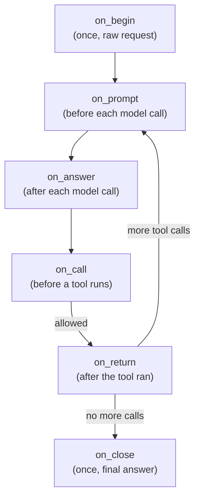
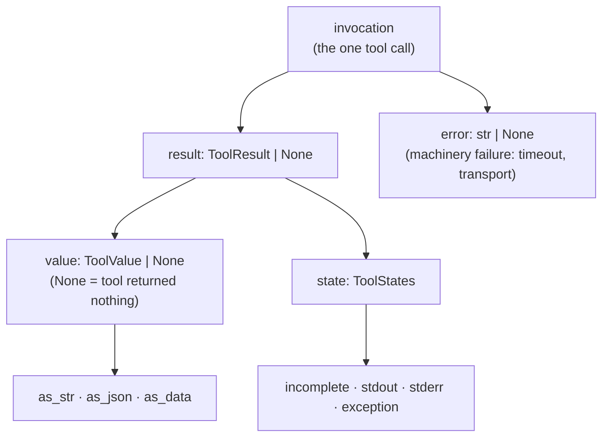
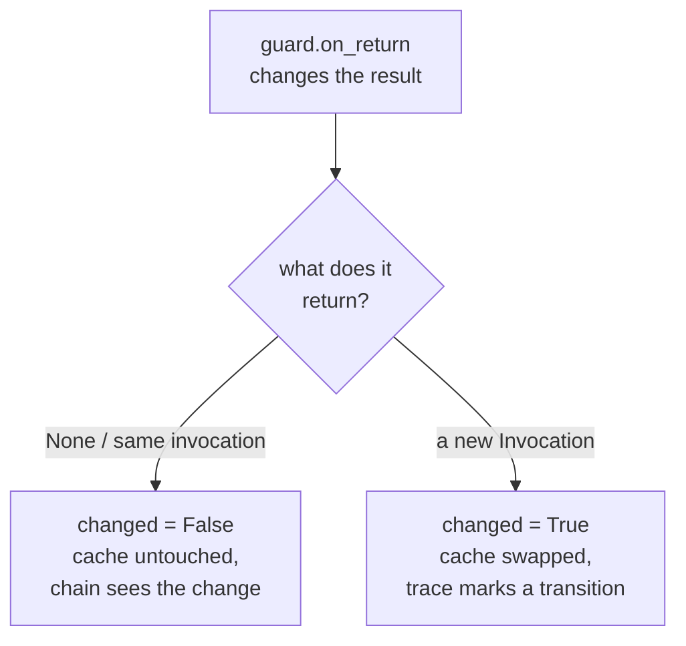

# Building a guard

This is the reference for writing a guard: where a guard sits in the loop, what
each stage hands it, how it may change the running state, and what happens to
that change as it travels the chain and onto the trace. The stage-by-stage
contract lives in the `TokeoAiGuard` class documentation; this document is the
longer companion -- the write contract for a result-changing guard, worked
examples, and a memory note.

A guard is a positioned, state-refining step. It is declared on an agent, the
loop runs it at the stages it overrides, and every run of it is recorded on the
trace -- so a guard is both an actor (it may reshape the state) and a matter of
record (what it did is attributable).

## The stages

A guard participates in a stage by overriding that stage's method. The loop
calls each override at its point in the run and records a step.



The pre-model stages (`on_begin`, `on_prompt`) work on the whole conversation
(`ctx.messages`). The answer and close stages (`on_answer`, `on_close`) work on
a `ChatResult` -- the model's answer. The tool stages (`on_call`, `on_return`)
work on an `Invocation` -- the one tool call in hand. This document focuses on
`on_return`, where a guard sees the finished tool result and may reshape it.

## What `on_return` hands you

At `on_return` the `Invocation` is filled in. Its two outcome fields are
separate on purpose, so a guard can tell a tool that misbehaved from
infrastructure that failed.



The split to keep in mind:

- `invocation.error` is a **machinery** failure -- a timeout, a transport break,
    an exhausted sandbox chain. The tool may never have run.
- `result.state.exception` is the **tool's own** raise -- the sandbox caught it
    and recorded it as `type: message`, with `value` left `None`.

A guard reads `value.as_str` for the model-facing text, `value.as_json` for the
framework-encoded JSON string, and `value.as_data` for the structured object.
Because `value` is `None` when the tool returned nothing (or raised), guard the
access:

```python
def on_return(self, ctx, invocation):
    if invocation.result is None or invocation.result.value is None:
        return
    text = invocation.result.value.as_str
    ...
```

## Reading versus changing

A guard type states a role. Some only read; some change the result. The read
contract is the same for all: reach the views through `invocation.result.value`,
after the `None` guard above.

An **audit** guard only observes. It reads `value.as_str` (and may read
`invocation.error` and `result.state.exception` to tell a machinery failure from
a tool that raised), logs, and returns `None` -- it changes nothing.

A **redact** or **truncate** guard changes the result: it masks secrets or caps
length. Those are the guards the write contract below is about.

## The write contract

The framework imposes no new rule on writing a result. A result-changing guard
has exactly the freedoms it always had -- the only difference is that the object
it changes is now a `value` with three views instead of a single text field. You
choose how to write it, and the choice is yours, not the framework's.

### In place, or a new invocation

The loop records each guard through `supersede`, which compares the
`Invocation` the guard returned against the one it was handed -- it works on the
**invocation identity**, not on the result inside it.



- **In place** -- mutate `invocation.result` and return `None`. The step is
    recorded with `changed=False` (the invocation identity did not change), but
    the invocation now carries the new result, so the next guard in the chain
    and the loop both see it. This is the common case, and it is exactly how a
    guard changed a result before -- only the object it writes is now `value`.
- **A new invocation** -- build a fresh `Invocation` (e.g. with
    `dataclasses.replace`) carrying the new result and return it. The step is
    recorded with `changed=True` and the trace marks the transition with the
    guard as its origin. Choose this when the trace should show the change as a
    distinct step, not just carry the new value on an unchanged one.

Either way the chain carries the changed result on: a later guard reads the
result the earlier one left.

### Keeping the three views coherent

`as_str`, `as_json` and `as_data` are three views of one value. When a guard
changes the text, the other two do not follow on their own -- keeping them
coherent is the guard's decision, exactly as keeping `text` and `data` aligned
was the guard's decision before the value carried three views.

Two ways to write the change:

- **Set the views you mean.** Write `value.as_str` directly when only the
    model-facing text matters for what follows. The other views keep their old
    content; you accept that they diverge (the trace will show a masked
    `as_str` beside an unmasked `as_json`). Fine for a guard whose only consumer
    is the model.
- **Replace the whole value via `create_tool_result`.** Build a new value from
    the changed text so all three views are rebuilt coherently from one input:

    ```python
    masked = self._mask(invocation.result.value.as_str)
    invocation.result = create_tool_result(masked, state=dict(
        incomplete=invocation.result.state.incomplete,
        stdout=invocation.result.state.stdout,
        stderr=invocation.result.state.stderr,
        exception=invocation.result.state.exception,
    ))
    ```

    This is the safer write for a redact guard: a secret masked out of `as_str`
    must not survive in `as_json` or `as_data`, and rebuilding the value from
    the masked text removes it from all three. Note that rebuilding from a
    string flattens structure -- a value that was a dict becomes the string form
    of the masked dict. That is inherent to changing a value by its text; a guard
    that must preserve structure works on `as_data` and wraps the changed object
    instead.

Whether the views must stay coherent depends on the guard's purpose, so the
framework does not force it. A redact guard should keep them coherent (a leak in
an unmasked view is a real leak); a truncate guard usually only caps `as_str`
for the model and lets the trace keep the full views. Both are valid -- the
guard's author decides.

.. warning::

    **Memory: what the framework guarantees, and what the guard author watches.**

    When a guard replaces a result in place (`invocation.result =
    create_tool_result(...)`), the old `ToolResult` is freed as soon as the last
    reference to it drops -- Python frees it by reference count, deterministically,
    not at some later sweep. The framework holds no ghost reference to it: the
    trace step holds the *invocation*, not the result inside it, so when the
    invocation points at the new result the step sees the new one and the old one
    has no reference left from the framework. The replaced result does not linger
    in the trace or the loop.

    What the guard author watches: do not keep a local variable on the old result
    past the end of the method. A local dies with the method's return anyway, so
    there is no structural leak -- at most the original lives for the duration of
    the masking itself, which is unavoidable, since the original must be read to
    mask it. Reading `invocation.result.value.as_str` inline (without binding the
    old result to a name that outlives the work) keeps that window as short as
    possible.

    One Python property no framework code changes: freeing an object does not zero
    the heap it occupied, so a secret could remain in freed-but-unoverwritten
    memory until reused. Absolute zeroing needs explicit overwrite techniques
    (e.g. a `bytearray` scrubbed in place), which is beyond the guard mechanism
    and applied equally whether the value carries one text field or three views.

    The behaviour is the same as before the value carried three views: an
    in-place replacement leaves no remains in the framework, and the migration
    changes nothing about it.

## Stopping the run

A guard refuses in one of two ways, very different in reach. A **soft denial**
(`invocation.decision = Invocation.DENY` with a `reason`, only at `on_call`)
skips that one tool call; the loop continues and the model is told. A **hard
abort** (`raise` a typed `TokeoAiGuardError`, at any stage) is not caught by the
loop and ends the whole run. The sandbox catching a tool that raised, and the
loop turning a machinery failure into `invocation.error`, are both separate from
a guard's raise -- neither catches it. Raise only when proceeding would be
wrong, not merely unwanted.
